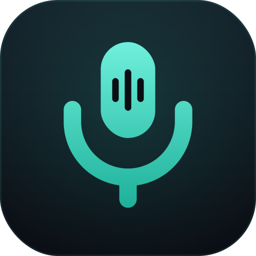
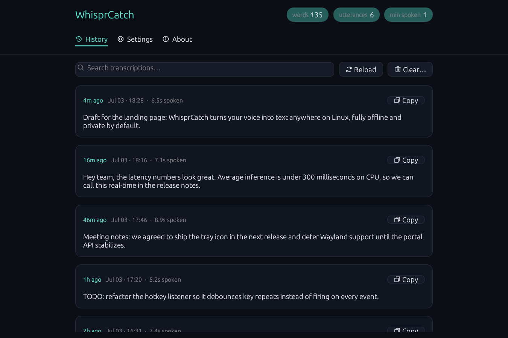
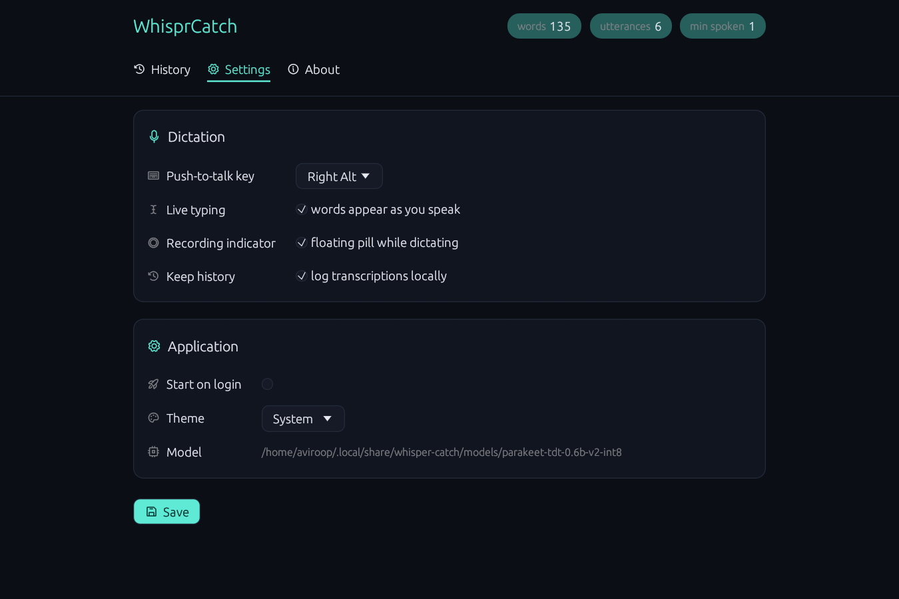

<div align="center">



# WhisprCatch

**Hold a key. Speak. Punctuated text appears wherever your cursor is.**

Local push-to-talk dictation for **macOS and Linux** — no cloud, no account, no audio leaving your machine.

[](LICENSE)
[](https://github.com/AviroopPaul/whisper-catch/releases/latest)
[](#install)

[**whisper-catch.vercel.app**](https://whisper-catch.vercel.app)

</div>

---

## Screenshots

While you dictate, a small pill floats near your cursor:

| Listening | Transcribing |
| :---: | :---: |
|  |  |

Every utterance is logged locally (optional) and browsable in the settings window:





## Why

- **On-device and private.** All inference runs locally via ONNX Runtime. Audio is never written to disk and never leaves the machine.
- **Real punctuation and capitalization.** The model emits properly punctuated text — no "period" or "comma" voice commands.
- **Fast.** ~25x realtime on CPU; text lands almost as soon as you release the key, and live typing streams words while you're still speaking.

## Install

### macOS (Apple Silicon)

1. Download `WhisprCatch-<version>-arm64.dmg` from the [latest release](https://github.com/AviroopPaul/whisper-catch/releases/latest).
2. Open the `.dmg` and drag **WhisprCatch** to Applications.
3. Launch it. Because the build is not yet notarized, the first launch is **right-click → Open** (once).

A first-run wizard requests the three permissions macOS needs — **Accessibility**, **Input Monitoring**, and **Microphone** — then downloads the speech model. macOS defaults to the lightweight **Moonshine** model (~64 MB, low RAM) so it runs comfortably on an 8 GB M1 Air. You can switch to the more accurate Parakeet model in Settings.

The push-to-talk key defaults to **Right ⌘** on macOS. WhisprCatch lives in the **menu bar** (not the Dock).

### Ubuntu / Debian

1. Download the `.deb` from the [latest release](https://github.com/AviroopPaul/whisper-catch/releases/latest).
2. Double-click it (or right-click → *Open with App Center*) and install.
3. Launch **WhisprCatch** from your app menu.

A first-run wizard handles keyboard permission (a one-time polkit prompt) and the model download (Parakeet, ~660 MB, resumable, SHA-256 verified).

**Terminal alternative (Linux):**

```sh
sudo apt install ./whisper-catch_amd64.deb
whisper-catch ptt
```

## Models

Pick a model in **Settings → Speech model** (downloaded on demand, SHA-256 verified):

| Model | Download | RAM | Notes |
| --- | --- | --- | --- |
| **Moonshine base** *(macOS default)* | ~64 MB | ~0.4 GB | Tiny and fast; great on an 8 GB MacBook Air. English, punctuated. |
| **Parakeet 0.6B** *(Linux default)* | ~660 MB | ~1.5 GB | Best English accuracy; beats Whisper large-v3 on WER. |

Both run int8 ONNX on the CPU via ONNX Runtime — no GPU, no cloud.

## Usage

Hold the hotkey, speak, release. The transcription is typed into whatever window has focus.

| Key (`key` in config) | Physical key |
| --- | --- |
| `rcmd` *(macOS default)* | Right Command ⌘ |
| `lcmd` | Left Command ⌘ |
| `ralt` *(Linux default)* | Right Alt / Right Option |
| `lalt` | Left Alt / Left Option |
| `rctrl` | Right Ctrl |
| `lctrl` | Left Ctrl |
| `super` | Super / Windows / ⌘ |
| `f13` | F13 |
| `scrolllock` | Scroll Lock (F14 on macOS) |

**Live typing** — with `streaming = true` (the default), words are typed as they stabilize while you're still holding the key; the remainder lands on release. Turn it off to get the full utterance in one shot.

**Tray** — a mic icon shows recording state, a Listening on/off toggle, session stats, and shortcuts to settings. GNOME needs the AppIndicator extension (Ubuntu ships it). Run with `--no-tray` to skip it.

**Settings & history** — `whisper-catch settings`, or click the app icon while the daemon is running. Browse past transcriptions, copy them, tweak options.

Other commands:

```sh
whisper-catch ptt --print-only   # transcripts to stdout instead of typing
whisper-catch record --seconds 5 # mic smoke test
whisper-catch transcribe file.wav
whisper-catch download-model     # pre-fetch the model
whisper-catch autostart --enable # start on login
```

## How it works

- **Models:** Moonshine base or NVIDIA Parakeet TDT 0.6B v2 — both int8 ONNX, run on the CPU via ONNX Runtime ([transcribe-rs](https://crates.io/crates/transcribe-rs)). No GPU needed; the ONNX Runtime is statically linked.
- **Hotkey:** raw evdev press/release listener on Linux (works on X11 and every Wayland compositor); a listen-only `CGEventTap` on macOS, so bare modifier keys work globally.
- **Mic:** cpal (CoreAudio / PipeWire) kept warm with a 300 ms pre-roll ring buffer so the first syllable isn't clipped; released after idle.
- **Injection:** enigo — XTEST on Linux, `CGEvent` on macOS — types the text into the focused window.
- **Tray:** a StatusNotifierItem via ksni on Linux; a native `NSStatusItem` menu-bar item on macOS.

Workspace layout: `crates/core` (capture, resample, engine), `crates/hotkey` (evdev / CGEventTap), `crates/inject`, `crates/models` (resumable downloader), `crates/tray` (ksni / tray-icon), `apps/cli` (the binary). See [`SCOPE.md`](SCOPE.md) for the full design doc.

## Configuration

Written with defaults on first run at `~/.config/whisper-catch/config.toml` (Linux) or `~/Library/Application Support/whisper-catch/config.toml` (macOS).

| Key | Default | Description |
| --- | --- | --- |
| `key` | `rcmd` (macOS) / `ralt` (Linux) | Push-to-talk key — see table above |
| `model` | `moonshine` (macOS) / `parakeet` (Linux) | Speech model: `moonshine` (light) or `parakeet` (accurate) |
| `streaming` | `true` | Type words live while speaking instead of all at once on release |
| `overlay` | `true` | Show the floating recording indicator while dictating |
| `history` | `true` | Keep a local log of transcriptions (`history.jsonl`) |
| `theme` | `"system"` | UI theme: `system`, `light`, `dark` |
| `model_dir` | *(unset)* | Override the model directory (advanced) |

## Building from source

**macOS** (needs the Xcode command-line tools):

```sh
cargo build --release -p whisper-catch
packaging/macos/build-dmg.sh   # → dist/WhisprCatch-<version>-arm64.dmg
```

See [`packaging/macos/README.md`](packaging/macos/README.md) for signing and notarization.

**Linux:**

```sh
sudo apt install cmake clang libasound2-dev
cargo build --release -p whisper-catch
```

To produce a `.deb` (ships the desktop entry, icons, a udev rule for `/dev/uinput`, and a postinst that adds you to the `input` group):

```sh
cargo install cargo-deb
cd apps/cli && cargo deb   # → target/debian/whisper-catch_*.deb
```

## Roadmap

- **Notarized macOS build** — Developer ID signature so grants survive updates and Gatekeeper opens it cleanly.
- **Wayland text injection cascade** — wlroots virtual-keyboard → uinput fallback (hotkey and capture already work on Wayland).
- **Streaming-native model** — true incremental decoding instead of rolling re-transcription.

## License

[MIT](LICENSE) © Aviroop Paul
